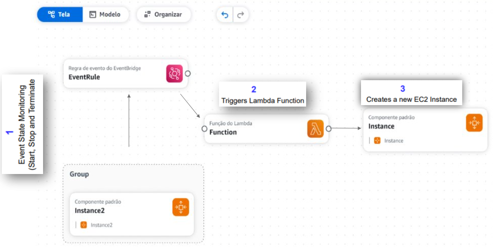

## Description

*Flow*
Event Bridge restarts EC2 with AWS Lambda if it accidentally terminated

```import json
import boto3
client=boto3.client('ec2')

def lambda_handler(event, context):
     response = client.run_instances(
     ImageId= 'ami-0b6d6dacf350ebc82', 
     InstanceType = 't2.micro',
     MaxCount=1,
     MinCount=1)
     print(response['Instances'][0]['InstanceId'])
```

 
